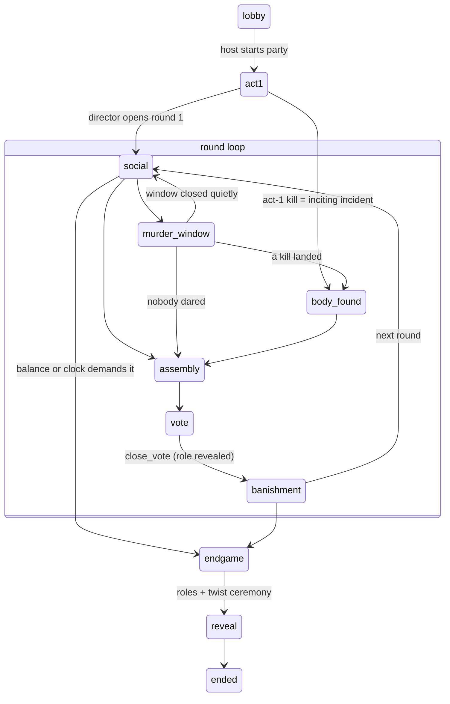

# PARLOUR — System Spec (ontology model)

> **Scope note (July 2026).** §§1–5 describe **classic murder mode**, the engine's
> first game and still accurate for it. The **ROGUE mode** built on top (the Long
> Con — D18–D45) adds: game statuses `live` and `unmasking` with round-phases
> `parley`/`accusation` (transitions owned by dedicated tools, not the LEGAL map);
> an economy layer (`transactions`, cached `players.balance`, escrowed `wagers` +
> `side_bets`); paper `codes`, `notes` + `wiretaps`, `forgeries`, `petitions`; and
> ~19 further director tools (28 total in `lib/schemas/tools.ts` — hijack, bribes,
> missions, adjudication, front-man appointment, parleys, accusations, the
> unmasking, meters, mail-handling, stamps, wagers). The authoritative
> mechanics-level description of the rogue night is `docs/OVERVIEW.md`; the
> ontology below still holds where it isn't superseded (events as truth, referee
> as sole mutator, visibility via RLS + column grants — `frontman_player_id` and
> `join_password` are revoked exactly like `sealed_story`).

How the engine works, in plain English, structured the way Palantir Foundry structures
an ontology: **object types** (with properties and links), **action types** (who may do
what, under which preconditions, with which effects), and the **processes** that animate
them (the phase machine, the director loop, the generation pipeline). `DECISIONS.md`
records *why* things are this way; this document records *what* and *how*.

The single most important sentence: **the `events` table is the append-only source of
truth; everything else is a materialized convenience, and every change to the world is
an action that passes through the referee** (`lib/engine/referee.ts`) — whether a human
player or the AI director asked for it.

---

## 1. Object types

### Game
The evening itself. One row per party.
| Property | Meaning |
|---|---|
| `code` | 4-letter join code (QR/URL) |
| `status` | `lobby → act1 → round → endgame → reveal → ended` |
| `round_no`, `round_phase` | where inside the round loop we are (`social / murder_window / body_found / assembly / vote / banishment`) |
| `paused` | break-glass flag — freezes all actions except announcements |
| `config` | knobs: target end time, round minutes, players-per-traitor, expiry windows (`lib/schemas/config.ts`) |
| `story_public` | title/tagline/skin — safe for every phone |
| `sealed_story` | the FULL Story object. **No client can select this column** (revoked grant) |

**Links**: has many Players, Events, Messages, Challenges, Murders, Votes, DirectorLog entries.

### Player
A real human at the party. Identity is a name tap (pseudo-account, anonymous auth underneath).
| Property | Meaning |
|---|---|
| `name` | real name, unique per game |
| `is_host` | Paul (and Co-Host if flagged). Hosts are blind players + break-glass holders |
| `status` | `lobby → alive → dead / ghost / banished → (respawn) → alive` |
| `role` | `faithful` or `traitor`. **Nobody is born a traitor** — see `complete_challenge` |
| `intake` | age, occupation, relation-to-host, relations-to-others, expected arrival |
| `character` | their Character object (see below) — readable by them alone |
| `panic` | set by the panic long-press; a hard "never arm, ease off" flag |

**Links**: belongs to Game; receives Messages and Challenges; casts Votes; appears in Murders as killer or victim.

### Character *(value object — lives inside Story and on Player, no table)*
A fictional persona written for (or dealt to) a player: `personaName`, `archetype`,
`publicBlurb`, `costumeHint`, private `background`, `connections[]` into other personas,
a `secret`, a `mannerism`, and an `entrance` beat (announcement + starter secret + a
nudge task for someone already present). Schema: `lib/schemas/story.ts`.

### Story *(value object — sealed on Game)*
Everything the AI writes for one party: `meta` (title/genre/setting), `skin` (UI tokens),
`characters[]` (one per registered player), `spares[]` (for door-joins and respawns),
`twist`, `killMethods[]` (10-second physical acts), `socialChallengePool[]` (difficulty-tiered),
`revealScript[]`, `awards[]`. The golden fallback instance is `content/golden-story.json`.

### Challenge
A secret offer to one player. `type` = `social` or `kill`. Lifecycle:
`offered → completed | expired | revoked`. Kill challenges carry a target and method and
an expiry — **expiry is the silent opt-out**: nobody ever learns it lapsed, the director
just re-offers elsewhere.

### Murder
`round_no, killer, victim, method`. A **unique index on (game, round)** is the kill lock:
simultaneous kills race in Postgres; exactly one wins; the loser surfaces as a `near_miss`
event. **The killer column is unreachable by every client** — public knowledge flows only
through `body_found`-style events, which omit it.

### Vote
`round_no, voter → target`, unique per voter per round (re-voting = upsert until closed).

### Event *(append-only — the source of truth)*
`type, payload, actor, is_public`. Public events power the TV house channel; private ones
exist for the director and the post-party debrief. Nothing is ever updated or deleted here.

### Message
A one-way delivery to one player: `kind` (secret / task / flavor / info / ghost_knowledge
/ system), title, body. RLS: recipient-only.

### The Director *(an actor, not a table)*
An LLM invoked on events and heartbeats. It sees a compressed state summary + the sealed
story + recent events, and returns a `DirectorProposal` — a short reasoning paragraph plus
a list of typed moves (`lib/schemas/tools.ts`). **It cannot touch the database**; every
move is validated and executed (or rejected, with a reason it sees next tick) by the
referee. Its full inner monologue is logged per tick in `director_log` — that table is
how you interrogate it after (or during) a party.

---

## 2. Visibility model — who can see what

| Object | A player sees | The host sees | The TV sees | The director sees |
|---|---|---|---|---|
| Game shell (status/phase/config/skin) | ✅ | ✅ | ✅ | ✅ |
| `sealed_story` | ❌ (column revoked) | ❌ | ❌ | ✅ |
| Own player row (incl. own role + character) | ✅ | ✅ (own) | — | ✅ (all) |
| Other players | name/status/arrival only (`players_public` view) | same | same | ✅ (all) |
| Messages / Challenges | own only (RLS) | own only | ❌ | ✅ |
| Murders (killer identity) | ❌ (no policy) | ❌ | ❌ | ✅ |
| Events | public only | public only | public only | ✅ (all) |
| `director_log` / `beats` | ❌ | ❌ (except break-glass "recent thinking" summaries) | ❌ | ✅ |

The invariant: secrecy is *architectural* (RLS + column grants + tables with no client
policies), never a prompt asking nicely. An engineer guest with dev tools open sees
exactly what their phone is entitled to and nothing else.

---

## 3. Action types

Format: **actor** · preconditions → effects (events emitted).

### Player actions (HTTP routes → referee)
- **join** *(anyone)* · game exists; name free or reclaiming with takeover → player row bound to this device; if story already sealed and game underway, an unused spare character is dealt on the spot (`player_joined`).
- **arrive** *(player)* · not yet arrived → `arrived_at` set, status lobby→alive (`player_arrived`) → *triggers director*, which normally plays that character's pre-written entrance beat.
- **complete_challenge (social)** *(player)* · challenge open + unexpired, player alive → completed (`challenge_completed`).
- **complete_challenge (kill)** *(player)* · open + unexpired; phase ∈ {act1, social, murder_window}; victim alive; not self → **murder row (kill lock!)**, killer becomes `traitor` (this IS the emergent-arming moment), victim `dead`; both get private system messages (`murder_committed` — killer/victim omitted from payload; on a lost race: `near_miss`).
- **vote** *(player)* · phase = vote; voter and target alive → vote upserted (`vote_cast`).
- **panic** *(player, long-press)* · always available → `panic=true` (`panic_pressed`, private) → *triggers director*, which revokes their open challenges and eases them out (`write_down`). Never visible to other players.

### Host actions (break-glass — `/api/breakglass`)
- **open** · host only → `paused=true` + a PUBLIC `seal_broken` event ("the house lights flicker"). Opening is never secret — that's what self-polices its use. Panel shows game state + the director's recent *reasoning summaries*, NOT the twist.
- **resume / skip_to_assembly / compress / extend_30 / end_gracefully** · coarse controls; each re-triggers the director.
- **reveal_twist** · explicit tap with a confirm — the only way any human unseals early.
- **start_party** · lobby → act1 (pre-seal control, not a seal break).
- **seal the story** (`/api/story/generate`) · host taps; response deliberately says only "sealed" + the public title.

### Director moves (LLM proposals, referee-validated — `lib/schemas/tools.ts`)
- **send_message** · target exists → message row. Used every beat on SEVERAL players (real secrets + flavor + jokes) so nobody meta-reads whose phone mattered.
- **offer_challenge** · target alive, never a panic-flagged player, kill only in act1/rounds → challenge row with expiry.
- **announce** · public event on the TV; or `viaAnnouncer` → a read-this-aloud task card to the host (keeps the host central while blind).
- **advance_phase** · legal per the phase graph below, else rejected.
- **run_entrance** · plays the arrival beat: public announcement + starter secret to the newcomer + nudge task to a connected present player.
- **respawn** · target dead/banished; unused spare exists → new character, `faithful`, alive (`player_respawned`).
- **write_down** · revokes open challenges, sends a gentle note (panic response).
- **close_vote** · phase = vote → tally; majority → banishment with PUBLIC role reveal; tie/no votes → no banishment (`vote_closed` / `player_banished`).
- **pacing** · log-only note (compress/extend intent).

### System actions
- **sweep_expired_challenges** · every director tick → overdue offers → `expired` (`challenge_expired`) → director sees it and silently re-arms someone else.
- **reveal_roles** · automatic on entering `reveal`: full cast/role table becomes one public event (the TV ceremony).

---

## 4. The phase machine



Encoded as the `LEGAL` map in `lib/engine/referee.ts` — the director may *request* any
arrow, the referee refuses anything not drawn here. Entering `social` increments
`round_no`. `paused` is orthogonal: it freezes every action except announcements.

**Balance notes the director receives every tick**: traitors ≥ faithful → endgame
condition; zero traitors alive mid-round → arm someone or move to endgame; time
remaining vs. target end (compress/extend).

---

## 5. The director loop

```
trigger (event: arrival / kill / panic / breakglass … OR heartbeat from the TV page or pg_cron)
  → sweep expired challenges
  → build context: state summary + sealed story digest + last 40 events
  → LLM call (heartbeat → FAST_MODEL; event → DIRECTOR_MODEL) returning DirectorProposal (zod-forced)
  → referee validates & executes each move; rejects with reasons
  → everything logged to director_log (trigger, reasoning, moves, verdicts)
```

Heartbeats are debounced server-side to ≥1/min for untrusted callers. The prompt
(`lib/director/director.ts`) encodes the direction principles: phones pocketed, decoy
cadence, drunk curve (simpler & shorter as the night goes), never reveal traitors,
never arm panic, zero moves is a legitimate move.

---

## 6. The generation pipeline (intake → sealed story)

```
players + intake ──prompt──▶ STORY_MODEL ──zod Story schema──▶ candidate
      ▲                                                          │
      │            structural validator (validateStoryStructure) ▼
      └── one retry with the problem list ◀── problems?  ──▶ clean → SEAL
                                                              │
                              both attempts fail ─────────────▶ golden story fallback
```

Sealing = write `sealed_story`, publish `meta+skin` as `story_public`, deal each
character onto its player's row. The structural validator is the mechanical safety net:
every registered player cast exactly once, no connection pointing at a nonexistent
persona, every character reachable by ≥2 plot threads. The **prompt guardrail** (D13)
is the human safety net: fictional sins only, never echo real relationships or anything
pointed. Hard rule: the party must never depend on generation succeeding — the golden
story loads silently on failure.

**Vetting valve**: `/api/story/samples` generates challenges from a throwaway theme so
the host can judge quality without unsealing anything.

---

## 7. The three seams (how future modes plug in)

The referee has exactly three semantic seams; a "mode" (infection, heist, cult…) is a
configuration of them plus story content — never a new engine:

1. **S1 — the dark offer**: what completing one does (v1: victim dies, actor becomes traitor).
2. **S2 — elimination**: what "out" means (v1: dead → ghost → respawn as spare).
3. **S3 — the vote**: what the round table resolves (v1: banish + role reveal).

Everything else in this spec is mode-agnostic. Full mode specs live in `docs/modes.md`.
Iron rule: a mode ships only with its simulate variant, director-prompt section, and one
real playtest.

---

## 8. Where to look when interrogating

| Question | Look at |
|---|---|
| Why is it built this way? | `DECISIONS.md` (D = design calls with Paul, B = build calls) |
| What can the AI actually do? | `lib/schemas/tools.ts` (the complete verb list) |
| What stops it doing something dumb? | `lib/engine/referee.ts` (every precondition) |
| What did it think at 21:43 last night? | `director_log` table (reasoning + moves + verdicts per tick) |
| What happened, in order? | `events` table (append-only, replayable) |
| What does a story look like? | `/bible` in the app (visual), `content/golden-story.json` (raw) |
| Does the whole machine hold? | `npm run simulate` (scripted full game, no LLM) |
